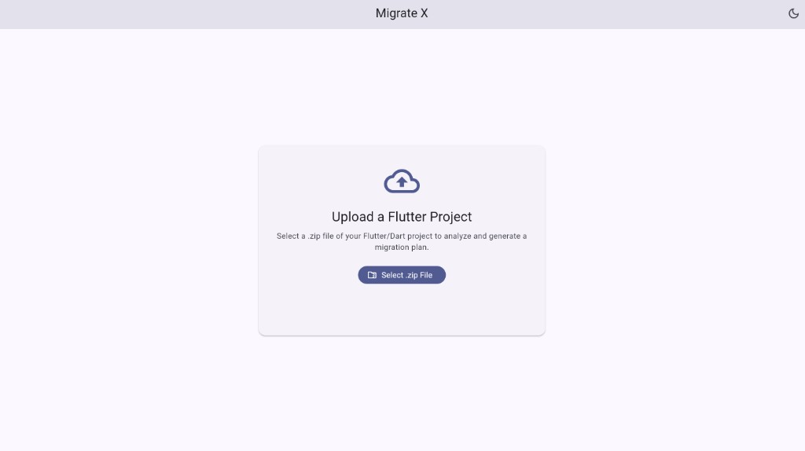
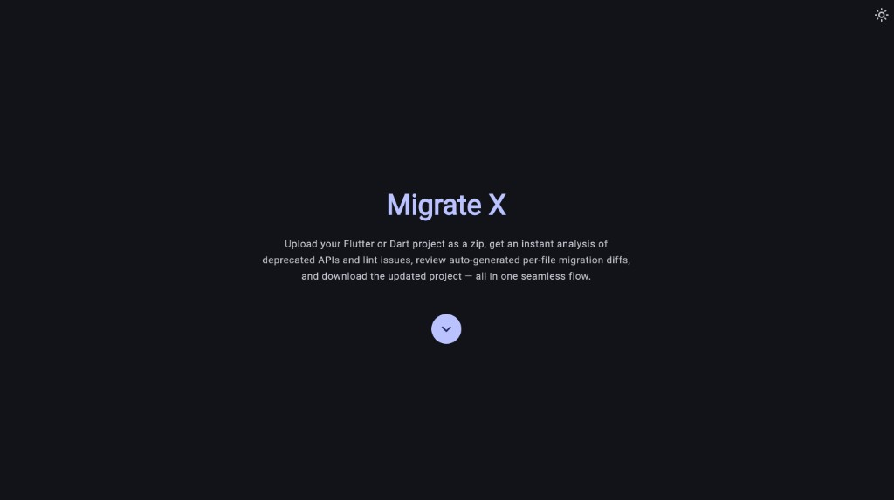
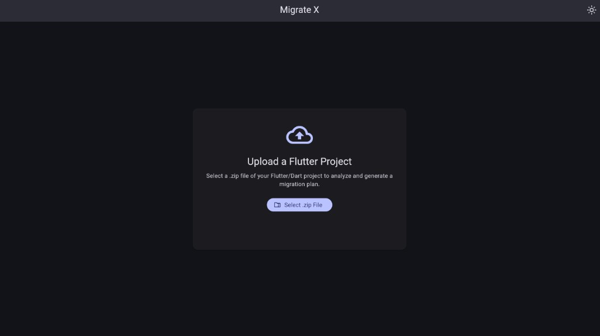
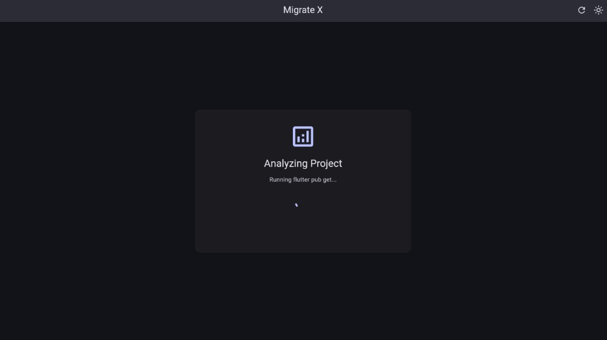
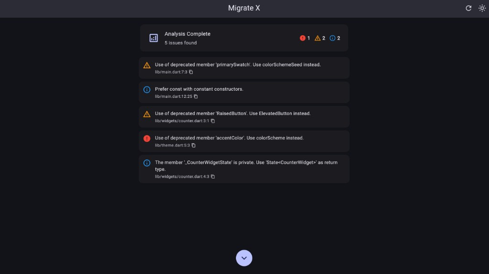
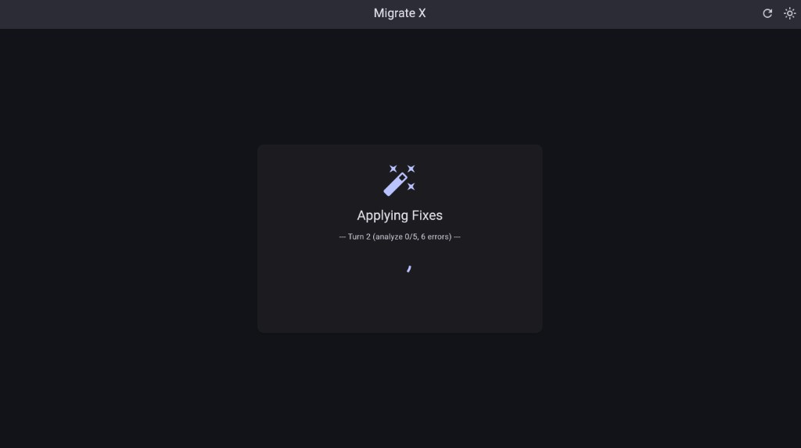
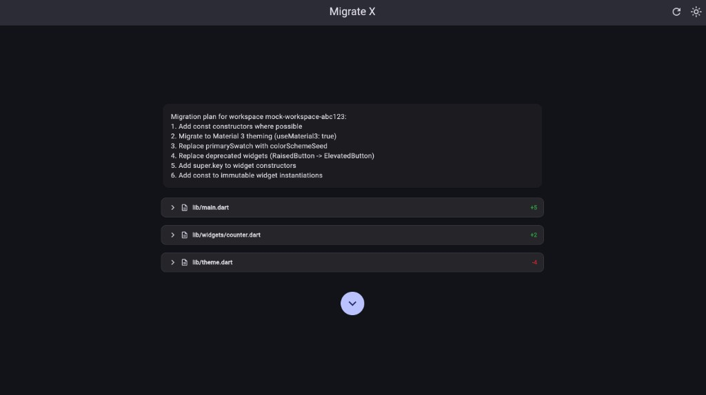
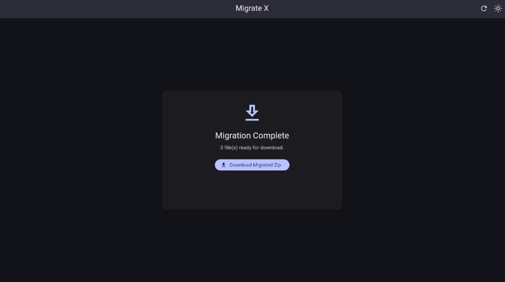

# Migrate X -- Automated Flutter & Dart Migration Tool

Migrate X is an open-source, AI-powered Flutter migration tool that automatically upgrades your Flutter/Dart project by fixing deprecated APIs, resolving lint issues, and migrating to Material 3. Upload your project as a zip, get an instant analysis with `dart analyze`, auto-fix errors using `dart fix --apply` and an AI agent (Claude), review per-file diffs, and download the upgraded project -- all from a modern web UI.

Whether you're upgrading from Flutter 2 to Flutter 3, migrating to Material 3 theming, replacing deprecated widgets like `RaisedButton` with `ElevatedButton`, or fixing `primarySwatch` to `colorSchemeSeed` -- Migrate X handles it automatically.

## Key Features

- **Automated deprecation fixes** -- runs `dart fix --apply` to bulk-fix deprecated Flutter and Dart APIs
- **AI-powered error resolution** -- an AI agent (Anthropic Claude) analyzes and fixes errors that `dart fix` can't handle, with real-time progress streaming via SSE
- **Static analysis** -- runs `dart analyze` to surface deprecated members, lint warnings, and compile errors
- **Per-file diff review** -- inspect every change before accepting, with syntax-highlighted side-by-side diffs
- **Material 3 migration** -- automatically updates `useMaterial3`, `colorSchemeSeed`, `ColorScheme.fromSeed()`, and deprecated color properties
- **Widget replacement** -- replaces deprecated widgets (`RaisedButton` -> `ElevatedButton`, `FlatButton` -> `TextButton`, `WillPopScope` -> `PopScope`, etc.)
- **Zero setup on your machine** -- upload a zip, get results in the browser; no local toolchain required
- **Light & Dark mode** -- fully themed Material 3 UI with theme toggle

## Screenshots

**Light Mode**

| Upload |
|:---:|
|  |

**Dark Mode**

| Landing | Upload |
|:---:|:---:|
|  |  |

| Analyzing | Analysis Results |
|:---:|:---:|
|  |  |

| Applying Fixes | Diff Review |
|:---:|:---:|
|  |  |

| Download |
|:---:|
|  |

## How It Works

1. **Upload** -- select a zipped Flutter or Dart project from your machine
2. **Analyze** -- the server runs `flutter pub get` and `dart analyze` to detect deprecated APIs, lint violations, and compile errors
3. **Auto-Fix** -- `dart fix --apply` handles standard deprecation fixes; an AI agent then tackles remaining errors that require deeper refactoring
4. **Review Diffs** -- inspect syntax-highlighted, per-file diffs showing every change made; accept or decline individually
5. **Download** -- export the fully migrated project as a zip

## Project Structure

```
migrate_x/
  backend/          — Dart HTTP API server (shelf + shelf_router)
  frontend/         — Flutter web app with Material 3 UI
```

## Getting Started

### Prerequisites

- Dart SDK >= 3.11.0
- Flutter SDK >= 3.41.1

### Environment Setup

1. Copy the example environment file in the backend:

```bash
cd backend
cp .env.example .env
```

2. Edit `.env` to set your desired port and workspace path:

```
PORT=8080
WORKSPACE_PATH=./workspace
```

3. Add your Anthropic API key to enable the AI agent for fixing errors that `dart fix` can't handle:

```
ANTHROPIC_API_KEY=sk-ant-...
```

### Running the Backend

```bash
cd backend
dart pub get
dart run bin/server.dart
```

The server starts at `http://0.0.0.0:8080` by default.

### Running the Frontend

```bash
cd frontend
flutter pub get
flutter run -d chrome
```

The app connects to `http://localhost:8080` by default. Update the base URL in `lib/providers/api_provider.dart` if your backend runs elsewhere.

## API Endpoints

| Method | Path                  | Description                                |
|--------|-----------------------|--------------------------------------------|
| POST   | `/upload`             | Upload a .zip file, returns workspace id   |
| DELETE | `/upload/:id`         | Delete a workspace                         |
| POST   | `/analyze/resolve/:id`| Run flutter pub get                        |
| GET    | `/analyze/:id`        | Run dart analyze on the uploaded project   |
| POST   | `/migrate/dry-run/:id`| Preview fixes without applying             |
| POST   | `/migrate/apply/:id`  | Apply fixes (supports SSE streaming)       |
| POST   | `/download/:id`       | Download the migrated project as .zip      |

## Tech Stack

- **Backend**: Dart, shelf, shelf_router, Anthropic Claude API
- **Frontend**: Flutter Web, Riverpod, Material 3
- **Streaming**: Server-Sent Events (SSE) for real-time AI agent progress
- **Analysis**: dart analyze, dart fix

## Use Cases

- Upgrading a legacy Flutter 2.x project to Flutter 3.x
- Migrating from Material 2 to Material 3 theming (`useMaterial3: true`, `ColorScheme.fromSeed()`)
- Bulk-fixing deprecated API calls across a large codebase
- Replacing deprecated widgets (`RaisedButton`, `FlatButton`, `WillPopScope`, `accentColor`, `primarySwatch`, etc.)
- Resolving lint warnings and `dart analyze` errors before a release
- Quick code review of what an automated migration would change, via diff preview

---

<h3 align="center">⭐ Star this repo if you find it useful — it helps others discover it and keeps development going!</h3>
